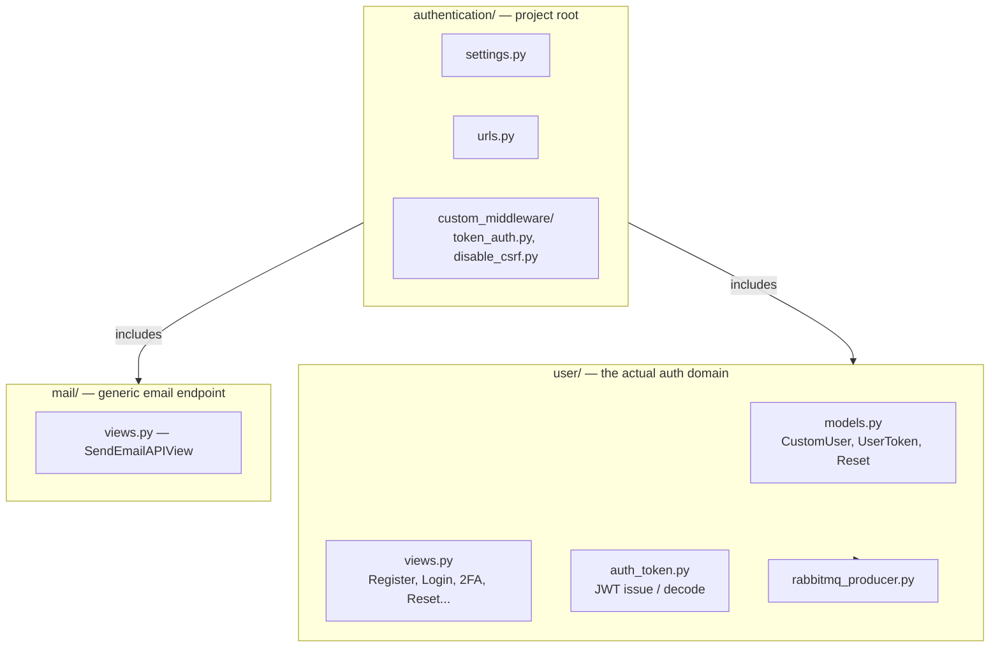
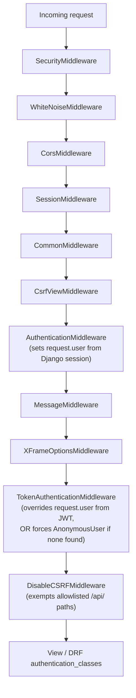
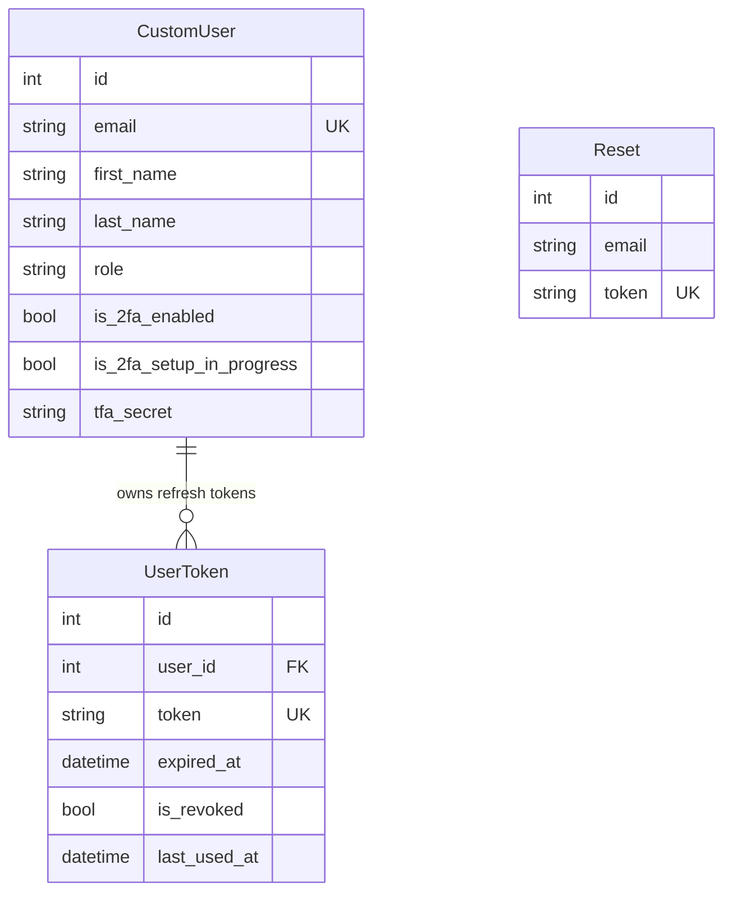

# Architecture

## The three Django apps

- **`authentication/`** — settings, root `urls.py`, and the two custom middleware classes that run on every request.
- **`user/`** — the real auth domain: the `CustomUser` model, JWT issuance/validation, and every login/2FA/password-reset view.
- **`mail/`** — a single generic SMTP email endpoint (`/mail/send-email/`), intentionally decoupled from the `user` app's own transactional emails (registration thank-you, password reset).

## Middleware chain

Every request passes through this stack, in this order:

The two custom middleware classes are the ones worth understanding in detail:

### `TokenAuthenticationMiddleware`

Runs on **every** request whose path isn't in its own `EXEMPT_PATHS` list. It reads a JWT from the `access_token` cookie first, falling back to an `Authorization: Bearer` header. If a valid token is found, it decodes it and sets `request.user` directly — bypassing DRF entirely. If the token is invalid or expired, it short-circuits with its own 401 JSON response before the view is ever reached.

The important side effect: if **no** token is present at all, it explicitly sets `request.user = AnonymousUser()` — which overwrites whatever Django's session-based `AuthenticationMiddleware` had already set upstream. In practice, this means most of `/api/*` is JWT-only even for views that look session-authenticated (see [`SECURITY.md`](SECURITY.md) for why this matters for CSRF).

### `DisableCSRFMiddleware`

An **explicit allowlist** of `/api/` paths exempted from Django's CSRF check (rewritten from a blanket "exempt all of `/api/*`" — see [`SECURITY.md`](SECURITY.md)). New endpoints are not exempt by default.

## Two overlapping authentication mechanisms

Because of the middleware above, a request's authenticated user can be resolved by **either** of two independent mechanisms, depending on the view:

1. **`TokenAuthenticationMiddleware`** (described above) — implicit, runs globally, sets `request.user` before any view code executes.
2. **`JWTAuthentication`** (`user/auth_token.py`, a DRF `BaseAuthentication`) — explicit, used only by views that declare `authentication_classes = [JWTAuthentication]` (`ValidateSessionAPIView`, `whoami_view`). Reads only the `Authorization` header, never cookies.

Views like `Toggle2FAAPIView` and `Verify2FASetupAPIView` don't declare `authentication_classes` at all — they rely entirely on mechanism #1 having already populated `request.user` by the time they run. This works today, but it's an implicit dependency on middleware ordering, not a self-documenting contract at the view level. Worth knowing before refactoring either piece in isolation.

## Token model

Three distinct JWTs, each with its own secret and lifetime (`user/auth_token.py`):

| Token | Lifetime | Secret | Carries | Notes |
|---|---|---|---|---|
| **Access** | 15 minutes | `JWT_ACCESS_SECRET` | `user_id`, `email`, `role` | Not revocable — a leaked access token is valid until it naturally expires. |
| **Refresh** | 7 days | `JWT_REFRESH_SECRET` | `user_id`, `email`, `role` | Persisted server-side in `UserToken` — every refresh is checked against the DB, so it **is** revocable (logout, or manual deletion). |
| **Temporary 2FA** | 10 minutes | `JWT_TEMP_SECRET` | `user_id`, `type: "2FA_temporary"` | Issued mid-login while awaiting an OTP; carries no role. |

Roles (`user/roles.py` — `admin`, `physician`, `technologist`, default `technologist`) are embedded directly in access and refresh tokens, so any consumer of the token can check a user's role without a database round trip.

## Session, assurance, and security controls

The JWTs are only part of the picture now. The backend also maintains a server-side `AuthSession` record for each live auth session. That session tracks:

- `sid` — a stable UUID session identifier
- `recent_auth_at` — when the last qualifying strong proof happened
- `authentication_method` — how the session was established
- `authentication_strength` — the current assurance level (`password` or `mfa`)

That `AuthSession` data powers the generalized step-up layer introduced in A6. Sensitive actions consult a central evaluator that checks freshness and strength, then returns `403 STEP_UP_REQUIRED` when the current session is authenticated but not sufficiently fresh or strong.

A5 adds a separate PostgreSQL-backed `AbuseCounter` model for noisy flows like login, OTP, password reset, reauthentication, and MFA change. Those counters are authoritative across requests and workers; they are not the same thing as `AuthSession`, and they do not represent account state.

The durable `SecurityEvent` table is the append-only audit trail. It records what happened, but it does not participate in the authorization decision itself.

## Data model

`Reset` is intentionally not tied to `CustomUser` by foreign key — it's looked up by the reset token itself, then cross-referenced to a user by email. See [`AUTH_FLOWS.md`](AUTH_FLOWS.md) for the full reset sequence.
