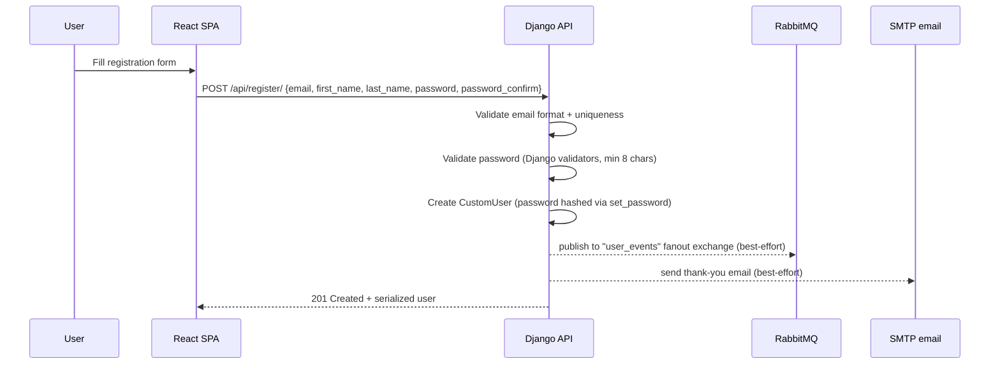
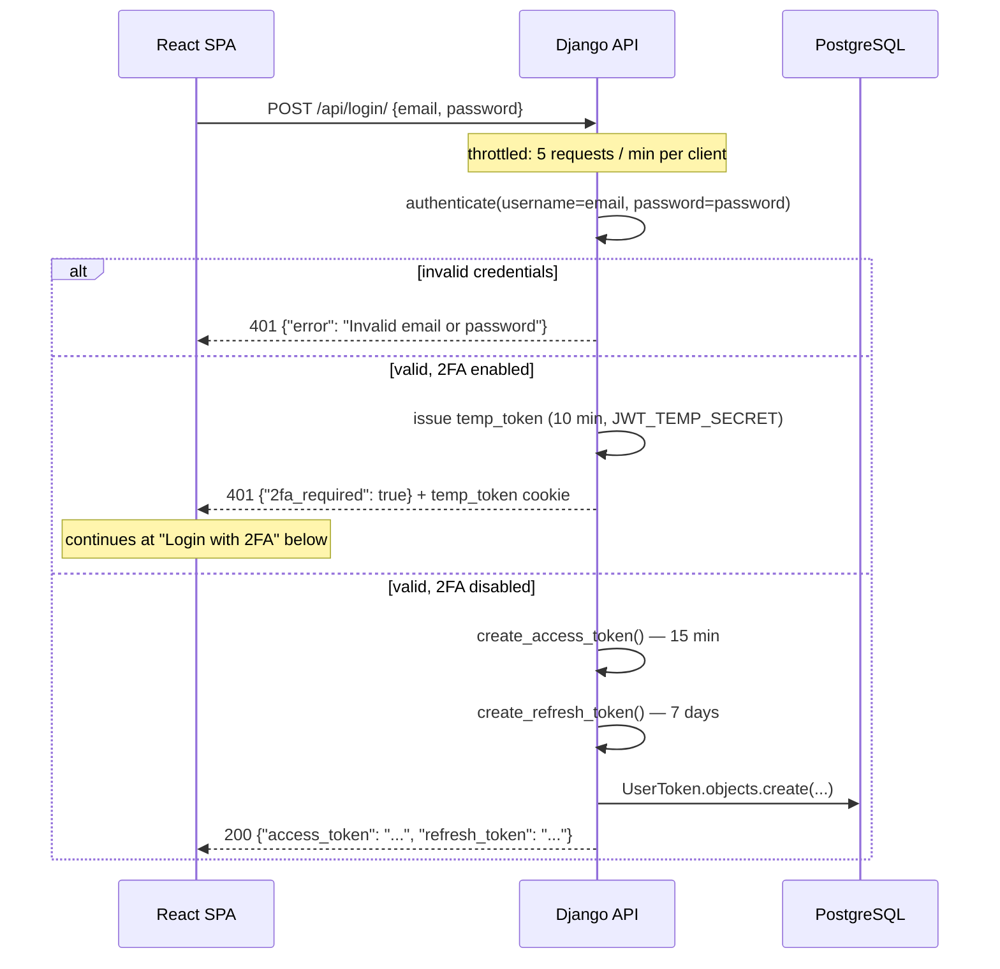
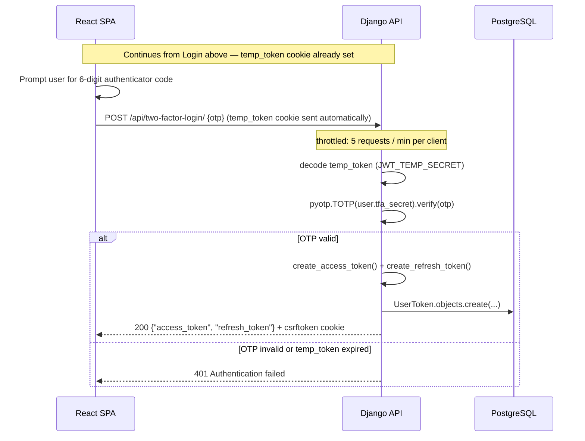
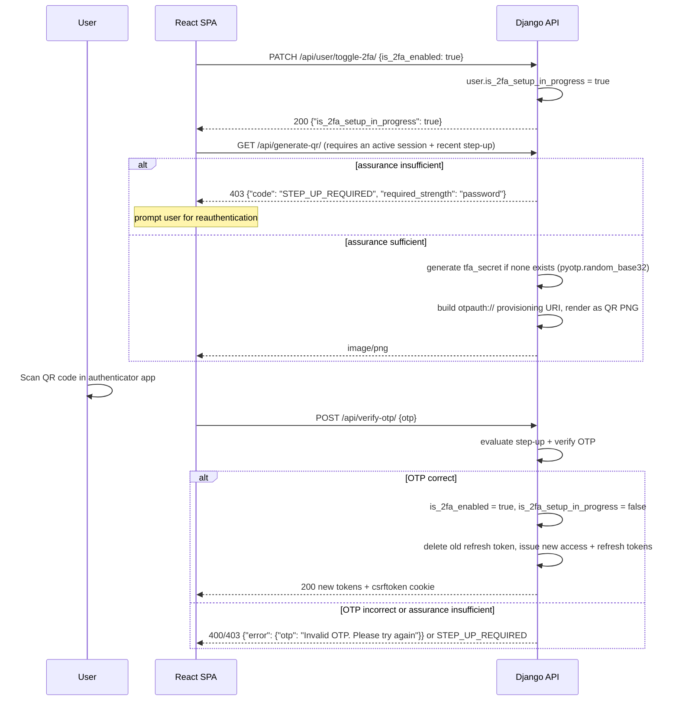
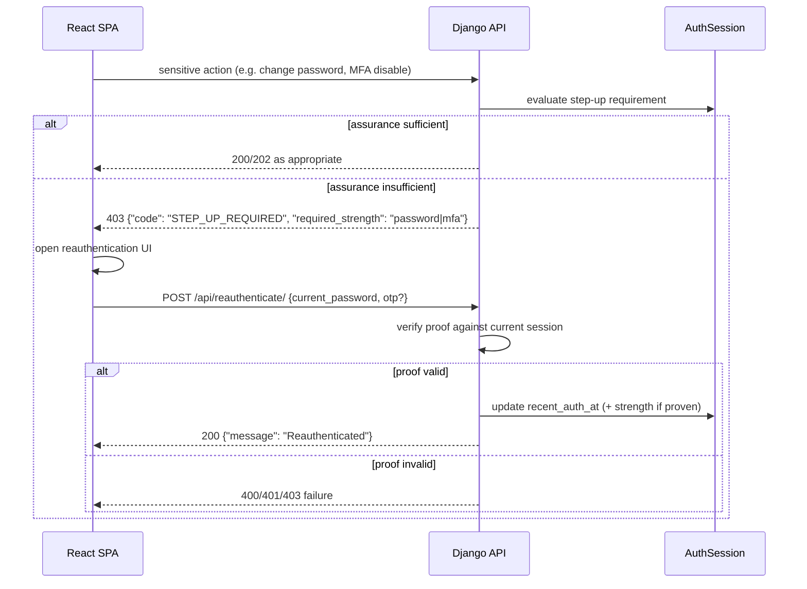
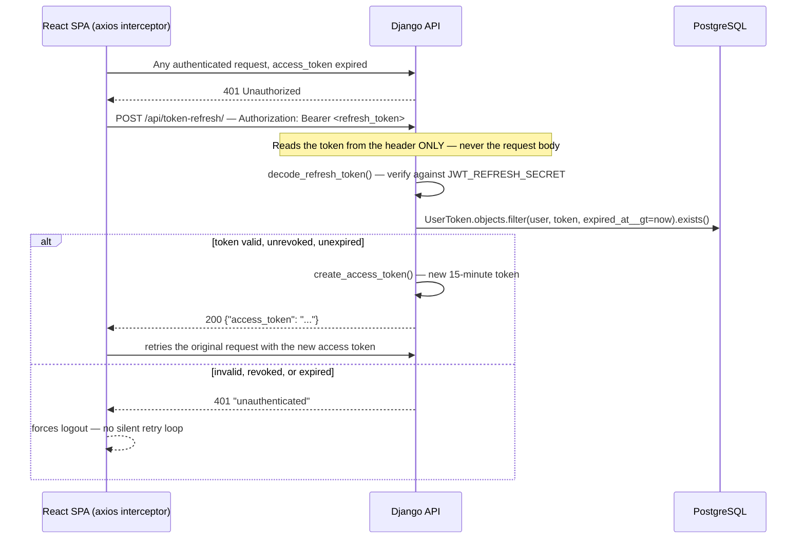
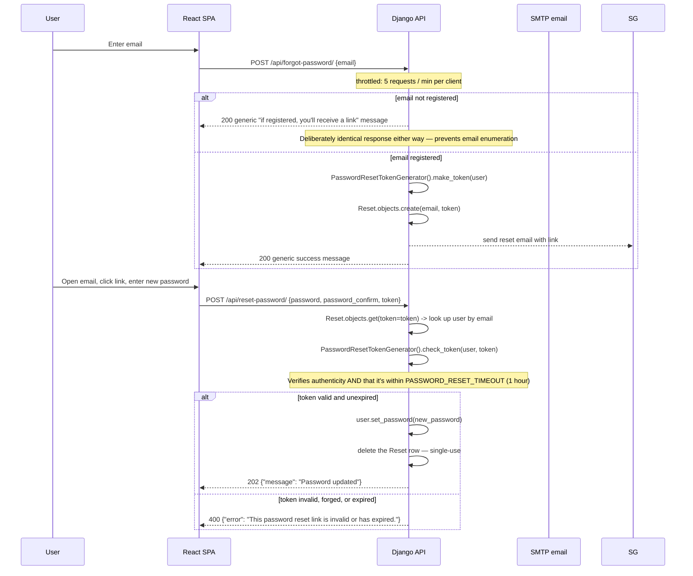
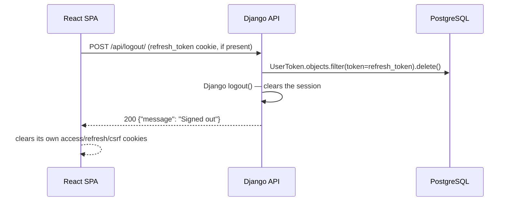

# Authentication Flows

Every flow the API supports, end to end. All request/response shapes are exact — pulled from `user/views.py`, not approximated.

## Registration

Both the RabbitMQ publish and the SMTP email send are **best-effort** — failures are logged, never raised. Registration succeeds even if either downstream system is unreachable.

## Login (2FA disabled — the common case)

## Login with 2FA

## 2FA setup (first time)

If a user starts this flow and abandons it, `is_2fa_setup_in_progress` is left dangling `true` — it gets silently reset to a clean disabled state on their **next successful login** (see the "Check if the 2FA setup was incomplete" step in `LoginAPIView`).

## Generalized step-up / reauthentication

This is the shared path for sensitive operations. Password change and MFA lifecycle actions now use the same underlying assurance rules instead of bespoke freshness checks.

## Token refresh

Note: `RefreshAPIView` only ever returns a **new access token** — refresh tokens are not rotated on use.

## Forgot / reset password

## Logout

