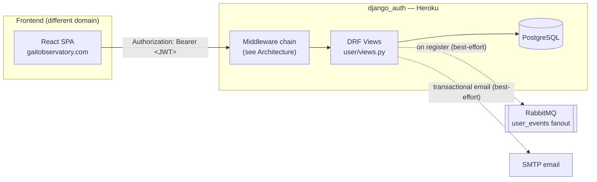

# Gait Auth API — System Manual

This is the maintainer's manual for the `django_auth` service. Where the top-level [`README.md`](../README.md) gets a new contributor running locally, this manual explains **how the system actually behaves** — the request paths, the token model, every auth flow end to end, and the trade-offs baked into the current design.

## Read this first

The frontend and this API live on **different registrable domains** (`gaitobservatory.com` vs `herokuapp.com`). That single fact drives several design decisions documented here — cookie-based CSRF can't work cleanly across it, tokens are transported via the `Authorization` header rather than relying on ambient cookies, and it's the reason a same-domain reverse proxy is the long-term plan. See [`SECURITY.md`](SECURITY.md) for the full reasoning.

The current hardening surface now extends beyond login and 2FA into recent-auth step-up, PostgreSQL-backed abuse control, and a durable security audit trail. The `A4`/`A5`/`A6` milestones in the codebase all build on the same `AuthSession` foundation.

## Manual contents

| Document | What's in it |
|---|---|
| [`ARCHITECTURE.md`](ARCHITECTURE.md) | The three Django apps, the full middleware chain, the two overlapping authentication mechanisms, and the token model |
| [`AUTH_FLOWS.md`](AUTH_FLOWS.md) | Sequence diagrams for every flow: register, login, 2FA login, 2FA setup, step-up / reauthentication, token refresh, password reset, logout |
| [`API_REFERENCE.md`](API_REFERENCE.md) | Every endpoint — method, auth requirement, abuse-control behavior, request/response shape |
| [`SECURITY.md`](SECURITY.md) | Current security posture: what's hardened, what's a deliberate deferred trade-off, and why |
| [`ENVIRONMENT.md`](ENVIRONMENT.md) | Every environment variable this service reads, and what breaks without it |
| [`DEPLOYMENT.md`](DEPLOYMENT.md) | How this ships to Heroku |

## The one-paragraph version

A user registers or logs in against `user/views.py`. Login returns a short-lived **access token** (15 min) and a longer-lived **refresh token** (7 days, revocable — tracked server-side in the `UserToken` table) in the JSON response body. If the account has 2FA enabled, login instead issues a 10-minute **temporary token** and the client must complete a second call with a TOTP code before getting real tokens. Sensitive actions use a generalized step-up policy built on `AuthSession.recent_auth_at` and `authentication_strength`; when the proof is too old or too weak, the backend returns `403 STEP_UP_REQUIRED` and the frontend asks for fresh password or MFA proof. Every subsequent authenticated request carries the access token in an `Authorization: Bearer` header; when it expires, the client calls `/api/token-refresh/` with the refresh token in that same header to get a new access token, without re-entering credentials.
